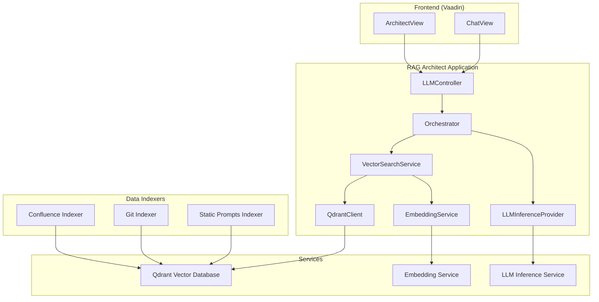

# RAGArchitect

RAGArchitect is a all-in-one, privacy-first Retrieval-Augmented Generation (RAG) system.


### Use-cases

#### "The tech lead updating confluence documentation"
As you have access to both code and confluence documentation, you can simply pass the code implementation and the confluence docs to RAGArchitect ask RAGArchitect it to update the article based on the code.

#### "Functional-Technical verification"
You can ask RAGArchitect to verify that all functional requirements have been implemented in the codebase. The devil is often in the details, and this tool will help you find all the devils.

#### "Feature implementation"
New features are often born as text, then translated to code. A technical person usually does the job of transforming the functional requirements to code. Using RAGArchitect, you can get a good first draft of how the technical implementation could be.

## What does RAGArchitect offer

### Control of the context window
Contrary to most RAG systems, RAGArchitect aims to put the user at the helm when deciding what goes in the context window.

Instead of using vector search to decide what code (or documentation) is most relevant, you are able to hand-craft your query
ensuring you don't miss out on context that might be critical for the LLM.

### Privacy
RAGArchitect is built to ensure no data ever leaves your machine.
Besides pulling information from sources (GitHub, Confluence, etc) you have the option of running inference locally, meaning no bad (or good) actors will have a chance to peek at your data.

### Connecting disparate data sources
Good context often stems from multiple sources. Source code in GIT, documentation in Confluence,etc.
With RAGArchitect you can write your own indexer to make this data available.
And if your data quality is bad - you have the option of correcting it before your prompt is sent for inference.

### Modular inference providers
You can use the Ollama container provided for local inference or connect to any inference provider (OpenAI, AWS Bedrock, etc)
If your provider isn't supported, it's easy to write your own proxy service to bridge the gap.

### Ask questions about your data
You can ask questions about whatever data you have ingested - from any source. 

## What RAGArchitect does not offer

### A conversational AI
RAGArchitect aims to exploit the context window of a single prompt - ie "zero-shot" prompting.
As all LLMs have a "context window", information is forgotten when the conversation moves beyond the limits of the context window.
You often see this as the AI "forgetting" what you told it earlier.

Thus, RAGArchitect aims to provide total transparency and a way to easily see when your prompt exceeds the models context window size - before inference takes place.


## Features

- Zero-shot chat interface for user interactions with code and documentation
- Integration with Qdrant for vector search
- Support for multiple LLM inference providers (Generic, Ollama, AWS Bedrock)
- Indexing of Git repositories and Confluence pages


## Architecture


This diagram illustrates the main components and their relationships:

1. The core application (`RagArchitectApplication`) contains the `LLMController`, which handles API requests.
2. The `Orchestrator` manages the interaction between the LLM inference and vector search services.
3. `LLMInferenceProvider` is an interface with implementations for different LLM services (e.g., AWS Bedrock, Ollama).
4. `VectorSearchService` uses `QdrantClient` to interact with the Qdrant vector database and `EmbeddingService` for text embeddings.
5. External services include Qdrant for vector storage, an Embedding Service, and an LLM Inference Service.
6. Data indexers (Git and Confluence) populate the Qdrant database with embeddings.
7. The frontend consists of `ChatView` and `ArchitectView`, which interact with the `LLMController`.


## Components

1. **Backend (Spring Boot)**
    - Main application logic
    - REST API endpoints under `/api/llm`:
      - `/chat` - For conversational interactions
      - `/prompt` - For raw prompt execution
      - `/vector-search` - For searching the vector database
    - Integration with Qdrant and LLM inference providers

2. **Frontend (Vaadin)**
    - Chat interface
    - Architect view for advanced interactions

3. **Qdrant**
    - Vector database for efficient similarity search

4. **Git Indexer**
    - Indexes code from Git repositories

5. **Confluence Indexer**
    - Indexes pages from Confluence

6. **Embedding Service**
    - Provides text embedding functionality

7. **Ollama (Optional)**
    - Local LLM inference provider

## Setup

1. Clone the repository:
   ```
   git clone https://github.com/jancalve/ragarchitect.git
   ```

2. Create a `.env` file with your configuration:
   ```bash
   # Copy the example .env file
   cp .env.example .env
   ```
   
   Then edit the `.env` file with your settings:
   ```
   # Authentication tokens
   CONFLUENCE_TOKEN=your_confluence_token_here
   GIT_TOKEN=your_git_token_here

   # Model paths (optional - defaults shown)
   EMBEDDING_MODEL_PATH=/app/models/all-MiniLM-L6-v2
   LLM_MODEL_PATH=/app/models/Llama-3.2-3B-Instruct
   ```
   
   The model paths are optional and will use the defaults if not specified. You can customize them to use different models:
   - `EMBEDDING_MODEL_PATH`: Path to your embedding model
   - `LLM_MODEL_PATH`: Path to your LLM model

3. Download models for Ollama (one-time)
   ```
   ./app/download_models.sh
   ```

4. Build and run the application:
   ```
   mvn clean package && docker compose -f docker-compose.yml -f docker-compose.ollama.yml --profile ollama up --build
   ```

## Configuration

The application supports three different modes of operation, each with its own profile. You can configure which models to use by setting environment variables in your `.env` file:

- `EMBEDDING_MODEL_PATH`: Path to the embedding model (default: `/app/models/all-MiniLM-L6-v2`)
- `LLM_MODEL_PATH`: Path to the LLM model (default: `/app/models/Llama-3.2-3B-Instruct`)

### Running with Different Profiles

1. **Generic Mode** (External adapter service)
   ```bash
   docker compose -f docker-compose.yml -f docker-compose.generic.yml --profile generic up
   ```
   This mode uses a external adapter service for LLM inference. See README.md at the relevant code.

2. **Ollama Mode** (Local LLM)
   ```bash
   docker compose -f docker-compose.yml -f docker-compose.ollama.yml --profile ollama up
   ```
   This mode uses Ollama for local LLM inference. Use this if you are not sure what to use.

3. **vLLM Mode** (Local LLM with vLLM) (BETA)
   ```bash
   docker compose -f docker-compose.yml -f docker-compose.vllm.yml --profile vllm up
   ```
   This mode uses vLLM for local LLM inference. This mode is in BETA.

### Example: Using Custom Models

To use custom models, you can either:

1. Set them in your `.env` file:
   ```
   EMBEDDING_MODEL_PATH=/path/to/your/embedding/model
   LLM_MODEL_PATH=/path/to/your/llm/model
   ```

2. Or set them directly in the command line:
   ```bash
   EMBEDDING_MODEL_PATH=/path/to/your/embedding/model \
   LLM_MODEL_PATH=/path/to/your/llm/model \
   docker compose -f docker-compose.yml -f docker-compose.ollama.yml --profile ollama up
   ```

The `SPRING_PROFILES_ACTIVE` environment variable is automatically set based on the profile you choose.

## Usage

1. Access the chat interface at `http://localhost:8080/chat`
2. Use the Architect view at `http://localhost:8080/architect` for architecting your own interactions

## API Endpoints

All LLM-related endpoints are grouped under `/api/llm`:

1. **Chat Endpoint**
   - URL: `/api/llm/chat`
   - Method: POST
   - Request Body: `{ "message": "your message here" }`
   - Description: Used for conversational interactions with the LLM

2. **Raw Prompt Endpoint**
   - URL: `/api/llm/prompt`
   - Method: POST
   - Request Body: `{ "message": "your prompt here" }`
   - Description: Used for executing raw prompts with full context control

3. **Vector Search Endpoint**
   - URL: `/api/llm/vector-search`
   - Method: GET
   - Query Parameters: 
     - `index`: The index to search in
     - `query`: The search query
   - Description: Used for searching through indexed content


#### Models
RAGArchitect supports various Hugging Face models for use with Ollama and vector search. To use a different model:

1. Download the model from Hugging Face:
   ```bash
   Edit ./app/download_models.sh and specify which model you want to download
   Run ./download_models.sh
   ```

2. Update your `.env` file using mistral as example:
   ```
   LLM_MODEL_PATH=/app/models/mistral-7b
   ```

3. Start the services with the ollama profile:
   ```bash
   docker compose -f docker-compose.yml -f docker-compose.ollama.yml --profile ollama up
   ```

## Development

- The main application code is in the `no.janco.ragarchitect` package.
- Frontend views are implemented using Vaadin in the `frontend` package.
- LLM inference providers are in the `inference` package.
- Indexers (pulling data from sources) are implemented as python scripts with a corresponding Dockerfile.
- Building and redeploying the system is done by running
   ```
   mvn clean package && docker compose -f docker-compose.yml -f docker-compose.ollama.yml --profile ollama up --build
   ```

## Direct dependencies

- Spring Boot 3.3.4
- Vaadin 24.5.0
- Qdrant Client 1.13.0

## Contributing

All contributions are welcome!
If you see a feature missing, open up a PR. Otherwise, check the open issue list to see how you can contribute to this project.

## Disclaimer
This README was created by RAGArchitect :-)

## License

MIT License

Copyright (c) 2025 Jan Christian Alvestad

Permission is hereby granted, free of charge, to any person obtaining a copy
of this software and associated documentation files (the "Software"), to deal
in the Software without restriction, including without limitation the rights
to use, copy, modify, merge, publish, distribute, sublicense, and/or sell
copies of the Software, and to permit persons to whom the Software is
furnished to do so, subject to the following conditions:

The above copyright notice and this permission notice shall be included in all
copies or substantial portions of the Software.

THE SOFTWARE IS PROVIDED "AS IS", WITHOUT WARRANTY OF ANY KIND, EXPRESS OR
IMPLIED, INCLUDING BUT NOT LIMITED TO THE WARRANTIES OF MERCHANTABILITY,
FITNESS FOR A PARTICULAR PURPOSE AND NONINFRINGEMENT. IN NO EVENT SHALL THE
AUTHORS OR COPYRIGHT HOLDERS BE LIABLE FOR ANY CLAIM, DAMAGES OR OTHER
LIABILITY, WHETHER IN AN ACTION OF CONTRACT, TORT OR OTHERWISE, ARISING FROM,
OUT OF OR IN CONNECTION WITH THE SOFTWARE OR THE USE OR OTHER DEALINGS IN THE
SOFTWARE.